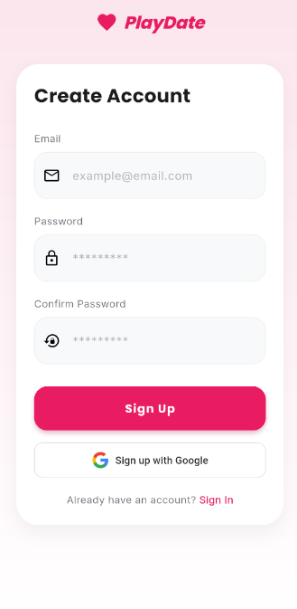
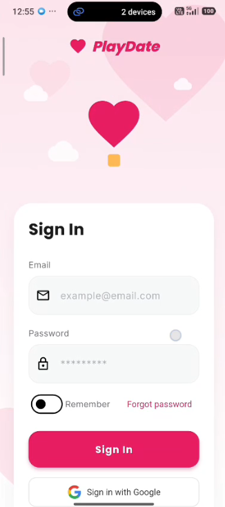
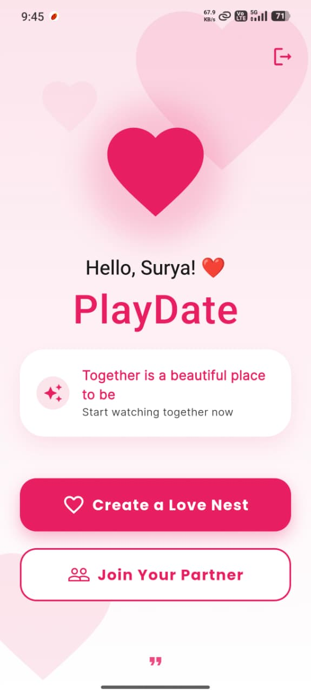
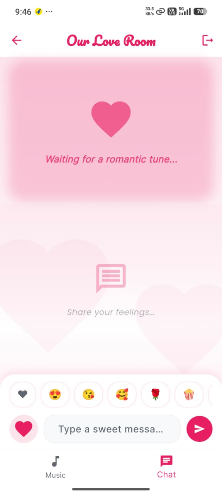

# PlayDate 🎵📱

PlayDate is a real-time synchronized media sharing application built with Flutter. It allows users to create virtual rooms where they can watch YouTube videos or listen to music together, synchronized in real-time, while chatting with their partner.

## ✨ Features

- **Real-time Synchronized Playback**: Watch and listen together! Play/pause and seek actions are synchronized for everyone in the room.
- **Virtual Rooms**: Create your own private room or join an existing one using a unique Room ID.
- **YouTube Integration**: Search and stream YouTube content directly within the app using `youtube_explode_dart` and `youtube_player_flutter`.
- **Live Chat**: Integrated real-time chat system powered by Firebase Realtime Database.
- **Seamless Authentication**: Secure user login and signup using Firebase Authentication (including Google Sign-In).
- **Beautiful UI**: Modern, clean, and responsive design using Material Design 3 and Google Fonts.
- **State Management**: Robust state management using the Provider pattern.

## 🛠️ Tech Stack

- **Frontend**: [Flutter](https://flutter.dev) (Dart)
- **State Management**: [Provider](https://pub.dev/packages/provider)
- **Backend/Database**: [Firebase Realtime Database](https://firebase.google.com/products/realtime-database)
- **Authentication**: [Firebase Auth](https://firebase.google.com/products/auth) & [Google Sign-In](https://pub.dev/packages/google_sign_in)
- **Media Playback**: [just_audio](https://pub.dev/packages/just_audio), [youtube_player_flutter](https://pub.dev/packages/youtube_player_flutter)
- **YouTube API**: [youtube_explode_dart](https://pub.dev/packages/youtube_explode_dart)

## 📁 Project Structure

```text
lib/
├── core/            # App constants, themes, and utility functions
├── data/            # Data models and repositories
├── logic/           # Business logic and Providers (Auth, Room, Player, Chat)
├── ui/              # UI components
│   ├── screens/     # Full-page screens (Home, Room, Chat, Auth, etc.)
│   └── widgets/     # Reusable UI components
├── firebase_options.dart # Firebase configuration
└── main.dart        # App entry point
```

## 🚀 Getting Started

### Prerequisites

- Flutter SDK (v3.10.0 or higher)
- Android Studio / VS Code
- Firebase Project

### Installation

1. **Clone the repository:**
   ```bash
   git clone https://github.com/your-username/playdate.git
   cd playdate
   ```

2. **Install dependencies:**
   ```bash
   flutter pub get
   ```

3. **Firebase Setup:**
   - Create a new project on the [Firebase Console](https://console.firebase.google.com/).
   - Enable **Authentication** (Email/Password and Google-Sign-In).
   - Enable **Realtime Database**.
   - Register your Android/iOS apps in the Firebase console.
   - Download the `google-services.json` (for Android) and `GoogleService-Info.plist` (for iOS).
   - Place them in `android/app/` and `ios/Runner/` respectively.
   - Run `flutterfire configure` to update `lib/firebase_options.dart`.

4. **Run the app:**
   ```bash
   flutter run
   ```

## 📸 Screenshots


| 📜 Splash Screen | 🔐 Sign Up |
|---------------|---------------|
|  |  |

| 🔐 Login Screen | 🏠 Home Screen |
|----------------|---------------|
|  |  |

| 💬 Chat Screen | 🎶 Inside Room |
|---------------|---------------|
|  |  |


## 🤝 Contributing

Contributions are welcome! Please feel free to submit a Pull Request.

---
Made with ❤️ by Surya
